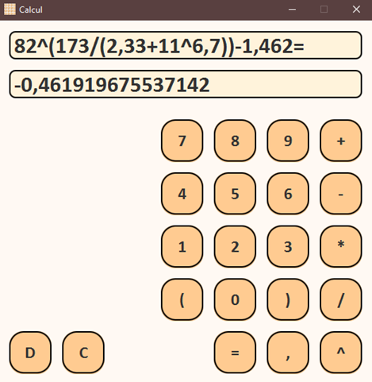

# Калькулятор "Calcul"

## Описание проекта 
JavaFX-приложение для выполнения арифметических вычислений с поддержкой многоуровневых скобок и длинных выражений.
Разработан как альтернатива стандартному Калькулятору Windows с расширенной функциональностью.

## Основной функционал  
1. **Поддерживаемые операции:**  
   - Сложение (+), вычитание (-), умножение (*), деление (/), возведение в степень (^).  
   - Скобки для группировки выражений.  

2. **Алгоритм работы:**
   - Поэтапное выполнение операций в порядке приоритетов:  
     1. Скобки.
     2. Возведение в степень (справа налево).
     3. Умножение/деление.  
     4. Сложение/вычитание.  

3. **Особенности:**  
   - Работа с выражениями любой длины.  
   - Минималистичный интерфейс с использованием JavaFX.  

## Системные требования  
- Windows OS (тестировалось на Windows 10).  

---
